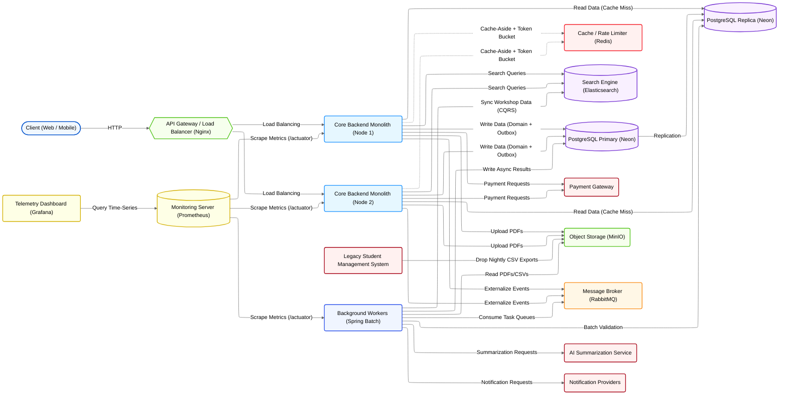

# UniHub Workshop — System Architecture

```mermaid
---
config:
  layout: elk
  look: classic
  fontFamily: '''Inter Variable'', sans-serif'
  themeVariables:
    fontFamily: '''Inter Variable'', sans-serif'
  theme: neutral
---
flowchart LR
    Client(["Client (Web / Mobile)"]) -- HTTP --> Nginx["API Gateway / Load Balancer (Nginx)"]
    Nginx -- Load Balancing --> App1["Core Backend Monolith (Node 1)"] & App2["Core Backend Monolith (Node 2)"]
    App1 -. "Cache-Aside + Token Bucket" .-> Redis["Cache / Rate Limiter (Redis)"]
    App2 -. "Cache-Aside + Token Bucket" .-> Redis
    App1 -- Read Data (Cache Miss) --> Replica["PostgreSQL Replica (Neon)"]
    App2 -- Read Data (Cache Miss) --> Replica
    App1 -- Search Queries --> ES["Search Engine (Elasticsearch)"]
    App2 -- Search Queries --> ES
    App1 -- Write Data (Domain + Outbox) --> Primary["PostgreSQL Primary (Neon)"]
    App2 -- Write Data (Domain + Outbox) --> Primary
    Primary -- Replication --> Replica
    App1 -- Payment Requests --> Pay["Payment Gateway"]
    App2 -- Payment Requests --> Pay
    App1 -- Upload PDFs --> S3["Object Storage (MinIO)"]
    App2 -- Upload PDFs --> S3
    Legacy["Legacy Student Management System"] -- Drop Nightly CSV Exports --> S3
    Worker["Background Workers (Spring Batch)"] -- Batch Validation --> Replica
    App1 -- Externalize Events --> Rabbit["Message Broker (RabbitMQ)"]
    App2 -- Externalize Events --> Rabbit
    Worker -- Write Async Results --> Primary
    Worker -- Consume Task Queues --> Rabbit
    Worker -- Read PDFs/CSVs --> S3
    Worker -- Sync Workshop Data (CQRS) --> ES
    Worker -- Summarization Requests --> AI["AI Summarization Service"]
    Worker -- Notification Requests --> Notify["Notification Providers"]
    Prometheus -- "Scrape Metrics (/actuator)" --> App1
    Prometheus -- "Scrape Metrics (/actuator)" --> App2
    Prometheus -- "Scrape Metrics (/actuator)" --> Worker
    Grafana -- "Query Time-Series" --> Prometheus

    Nginx@{ shape: hex}
    App1@{ shape: rounded}
    App2@{ shape: rounded}
    Prometheus["Monitoring Server (Prometheus)"]@{ shape: cyl}
    Grafana["Telemetry Dashboard (Grafana)"]@{ shape: rounded}
    Redis@{ shape: rounded}
    Replica@{ shape: cyl}
    ES@{ shape: cyl}
    Primary@{ shape: cyl}
    Pay@{ shape: rounded}
    S3@{ shape: rounded}
    Legacy@{ shape: rounded}
    Worker@{ shape: rounded}
    Rabbit@{ shape: rounded}
    AI@{ shape: rounded}
    Notify@{ shape: rounded}
     Client:::client
     Nginx:::nginx
     App1:::app
     App2:::app
     Redis:::redis
     Replica:::db
     ES:::db
     Primary:::db
     Pay:::external
     S3:::storage
     Legacy:::external
     Worker:::worker
     Rabbit:::broker
     AI:::external
     Notify:::external
     Prometheus:::monitor
     Grafana:::monitor
    classDef client fill:#f0f7ff,stroke:#0052cc,stroke-width:2px
    classDef nginx fill:#f6ffed,stroke:#52c41a,stroke-width:2px
    classDef app fill:#e6f7ff,stroke:#1890ff,stroke-width:2px
    classDef redis fill:#fff1f0,stroke:#f5222d,stroke-width:2px
    classDef db fill:#f9f0ff,stroke:#722ed1,stroke-width:2px
    classDef broker fill:#fff7e6,stroke:#fa8c16,stroke-width:2px
    classDef worker fill:#f0f5ff,stroke:#2f54eb,stroke-width:2px
    classDef storage fill:#f6ffed,stroke:#52c41a,stroke-width:2px
    classDef external fill:#fff1f0,stroke:#a8071a,stroke-width:2px
    classDef monitor fill:#feffe6,stroke:#d4b106,stroke-width:2px
```
